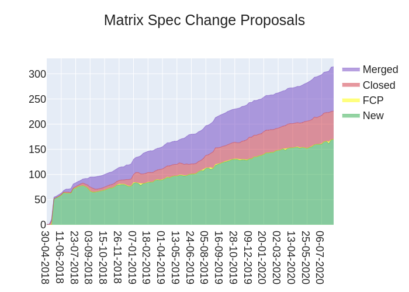
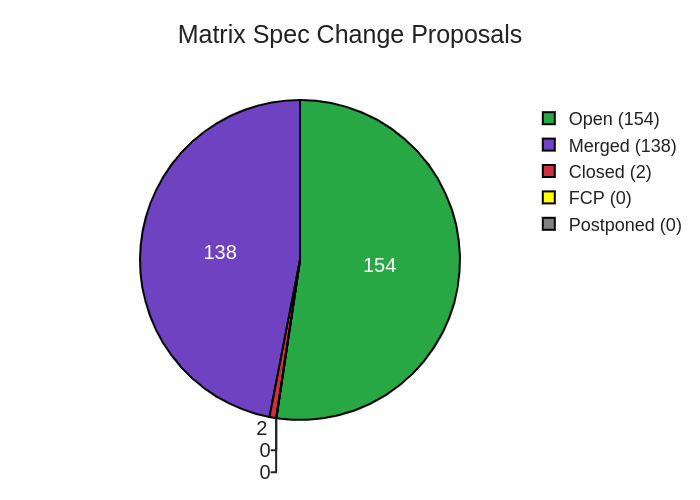

# MSC Chart Generator

Generate nice charts representing progress of [Matrix Spec
Changes](https://matrix.org/docs/spec/proposals) over time.

## Supported Chart Types

### Stacked Area Charts



### Pie Chart



## Installation

`msc-chart-generator` is available on
[PyPI](https://pypi.org/project/msc-chart-generator/). Install it
with:

```sh
pip install msc-chart-generator
```

You'll also need to install some nodejs dependencies into your environment
as well. These are necessary for being able to export chart images.

```sh
npm install -g electron@6.1.4 orca
```

## Quickstart

Create a `MSCChart` object providing a github access token:

```python
from msc_chart_generator.msc_chart import MSCChart

# This token only needs read:public_repo
msc_chart = MSCChart(github_token="abcdefghijklmopqrstuvwxyz")
```

or supply a [PyGithub](https://github.com/PyGithub/PyGithub) object:

```python
from msc_chart_generator.msc_chart import MSCChart
from github import Github

# This token only needs read:public_repo
github = Github("abcdefghijklmopqrstuvwxyz")
msc_chart = MSCChart(pygithub=github)
```

Generate a chart:

```python
from msc_chart_generator.msc_chart import ChartType

msc_chart.generate(type=ChartType.STACKED_AREA, filepath="chart.png")
```
